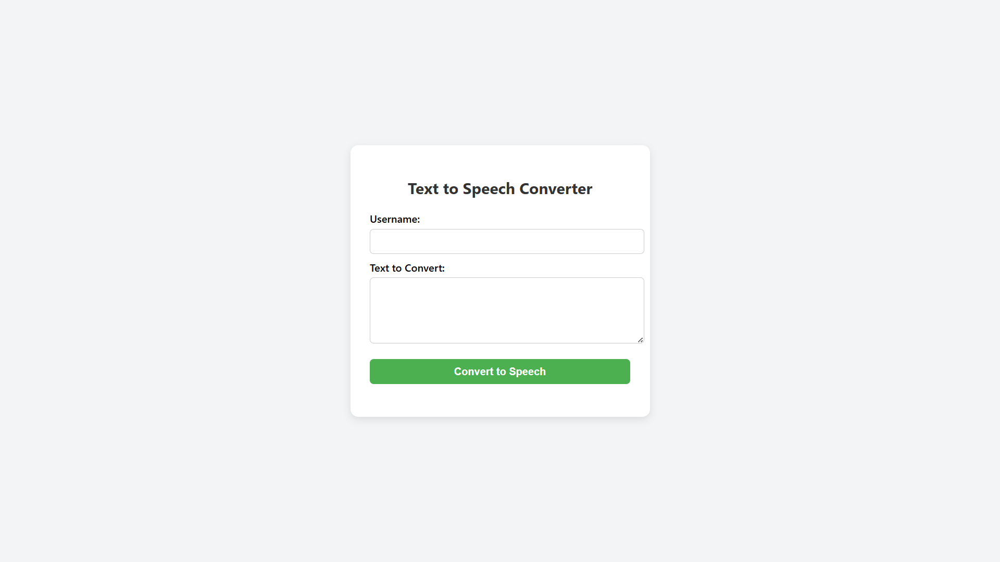
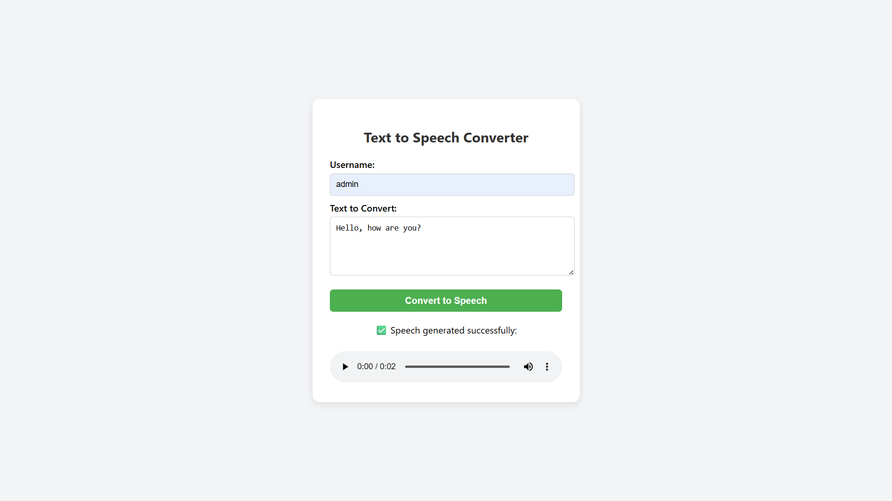

# Text_To_Speech

# 🗣️ Text to Speech Converter using Django + gTTS

---

## 1. ✅ Task Description

A Django-based web app where:
- User enters **name** and **text**.
- Text is converted to **speech** using `gTTS`.
- The output is saved as `.mp3` inside a folder named after the user.
- User can play the audio after submission.

---

## 2. 🖼️ Attach Screenshot Of Output

### 🏠 Screenshot 1: Home Page Input Form

### 🔊 Screenshot 2: Output with Audio Player

🎧 Sample Output MP3:  
[▶️ Listen to Sample](https://raw.githubusercontent.com/Vishvajitsinh-Chudasama/Text_To_Speech/textspeech/media/admin/speech.mp3)

---

## 3. ⚙️ Describe Widget/Algorithm Used In Task

- **Frontend**: HTML form + JavaScript `fetch()` to send text and name.
- **Backend**:
  - Uses `request.POST.get()` to receive data.
  - Converts text using `gTTS`.
  - Saves `.mp3` in `media/<username>/speech.mp3`.
  - Returns file URL in `JsonResponse`.
- **Audio**: HTML5 audio tag used to play the file.
